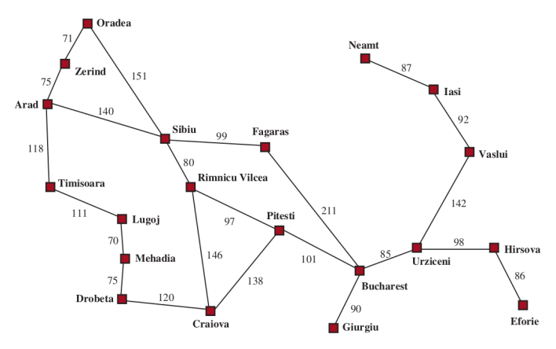
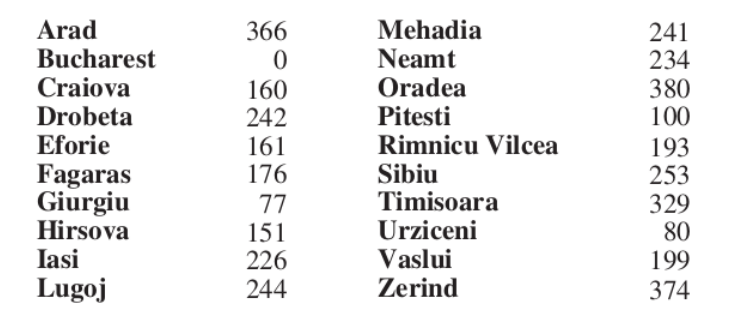
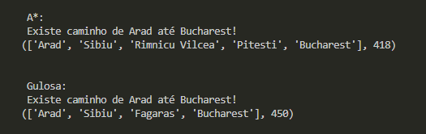
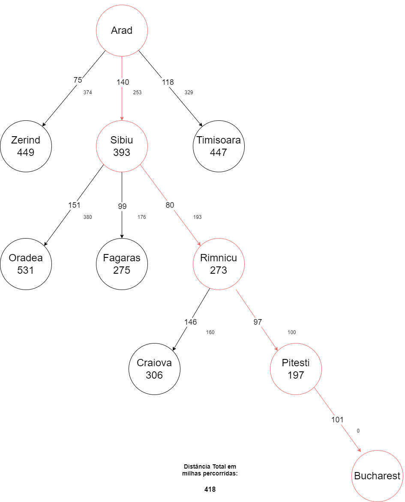
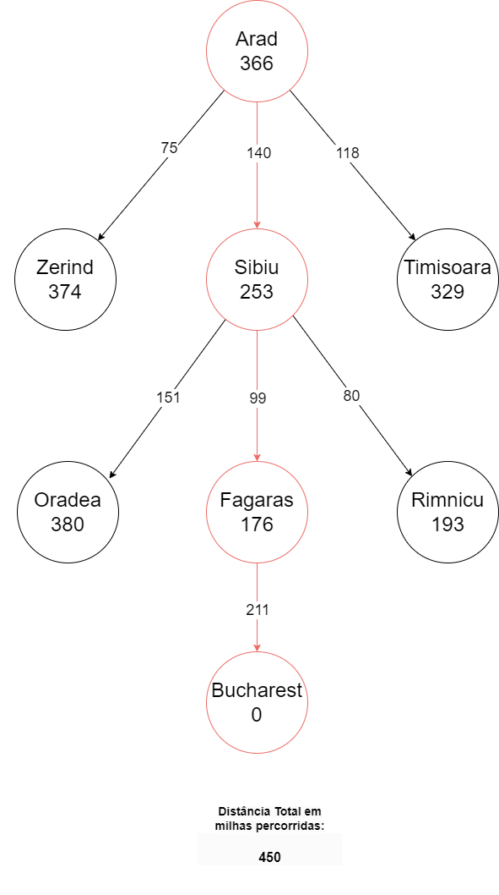

# Buscas Heurísticas

## Otimização de rota entre Arad e Bucharest: Escolher menor rota entre os destinos utilizando as buscas heurísticas (Gulosa e A*)

* Código desenvolvido para a disciplina de Inteligência Artificial - ECOI19, cursada na Universidade Federal de Itajubá - _Campus_ Itabira

* Problemática do trabalho:
    * Selecionar a rota com menor custo para ir da origem até o destino definido (Arad > Bucharest) , com base na malha rodoviária das cidades da Romênia.
    * Verificar qual dos trajetos tem maior complexidade, completude e otimalidade, além de fornecer o caminho mais otimizado , visando os pontos que percorreu, as milhas percorridas e os pontos verificados para a escolha do caminho.
    * Desenvolver a implementação utilizando os dois diferentes métodos de busca definidos pelo docente ( Busca Gulosa e Busca A*)

### Malha rodoviária das cidades da Romênia

### Distância de cada uma das cidades até o destino proposto (Bucharest)

### Comparativo resumido dos algoritmos de busca definidos, levando em cotna a completude, complexidade e otimalidade de cada método

### Resultado da implementação 

### Caminho Percorrido - Busca A* (A estrela)

### Caminho Percorrido - Busca Gulosa

